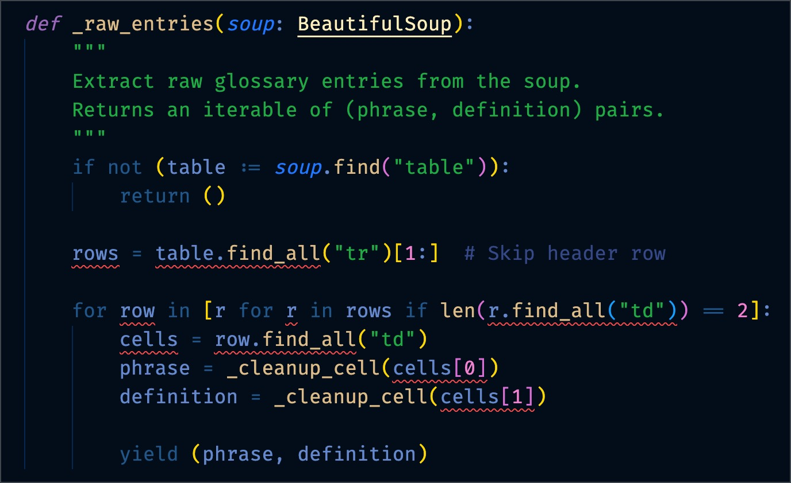
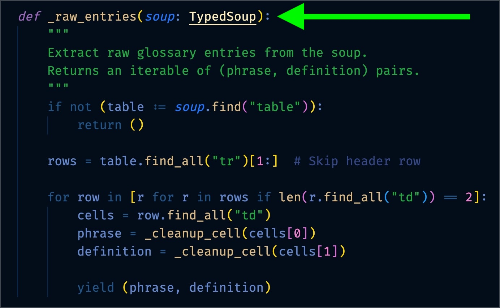

# typed-soup

A type-safe wrapper around BeautifulSoup and utilities for parsing HTML/XML with robust return types and error handling.

## Motivation

### Before

<div style="text-align: center">

</div>

Here are the first five errors. There are 16 in total.

```
  error: Type of "rows" is partially unknown
    Type of "rows" is "list[PageElement | Tag | NavigableString] | Unknown" (reportUnknownVariableType)
  error: Type of "find_all" is partially unknown
    Type of "find_all" is "Unknown | ((name: str | bytes | Pattern[str] | bool | ((Tag) -> bool) | Iterable[str | bytes | Pattern[str] | bool | ((Tag) -> bool)] | ElementFilter | None = None, attrs: Dict[str, str | bytes | Pattern[str] | bool | ((str) -> bool) | Iterable[str | bytes | Pattern[str] | bool | ((str) -> bool)]] = {}, recursive: bool = True, string: str | bytes | Pattern[str] | bool | ((str) -> bool) | Iterable[str | bytes | Pattern[str] | bool | ((str) -> bool)] | None = None, limit: int | None = None, _stacklevel: int = 2, **kwargs: str | bytes | Pattern[str] | bool | ((str) -> bool) | Iterable[str | bytes | Pattern[str] | bool | ((str) -> bool)]) -> ResultSet[PageElement | Tag | NavigableString])" (reportUnknownMemberType)
  error: Cannot access attribute "find_all" for class "PageElement"
    Attribute "find_all" is unknown (reportAttributeAccessIssue)
  error: Cannot access attribute "find_all" for class "NavigableString"
    Attribute "find_all" is unknown (reportAttributeAccessIssue)
  error: Type of "row" is partially unknown
    Type of "row" is "PageElement | Tag | NavigableString | Unknown" (reportUnknownVariableType)
```

### After

Changing one line of code to use `TypedSoup` instead of `BeautifulSoup` fixes all the errors:

<div style="text-align: center">

</div>

## Installation

```bash
pip install typed-soup
```

## Usage

```python
from typed_soup import from_response
from scrapy.http.response.html import HtmlResponse

# Assume 'response' is an HtmlResponse object
soup = from_response(response)

# Find an element
element = soup.find("div", class_="example")
if element:
    print(element.get_text())

# Find all elements
elements = soup.find_all("p")
for elem in elements:
    print(elem.get_text())
```

I'm adding functions as I need them. If you have a request, please open an issue.

## License

This project is licensed under the MIT License.
